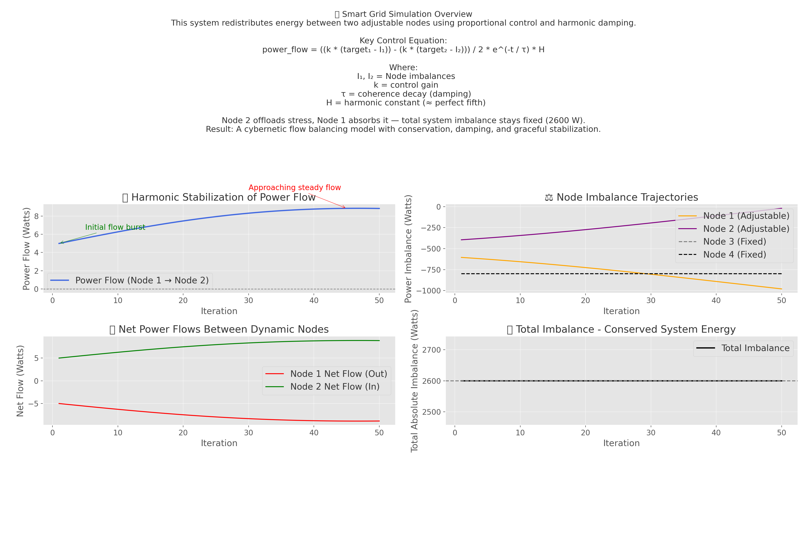

# cybernetic-smart-grid
Simulated a cybernetic smart grid where imbalance is redistributed—not erased—via harmonic stabilization and damping. Total system energy is conserved. Control equation derived and visualized.

